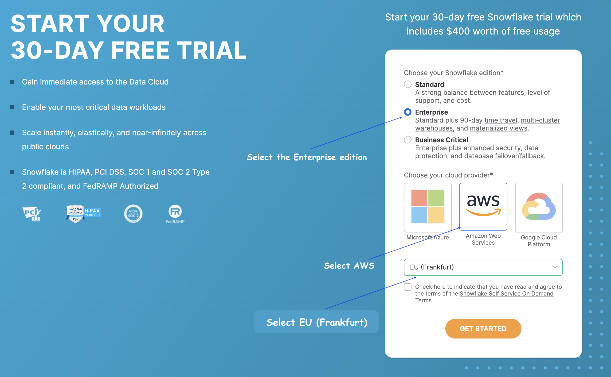
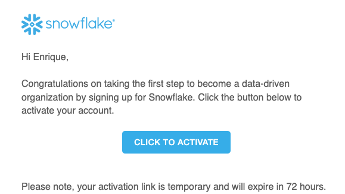
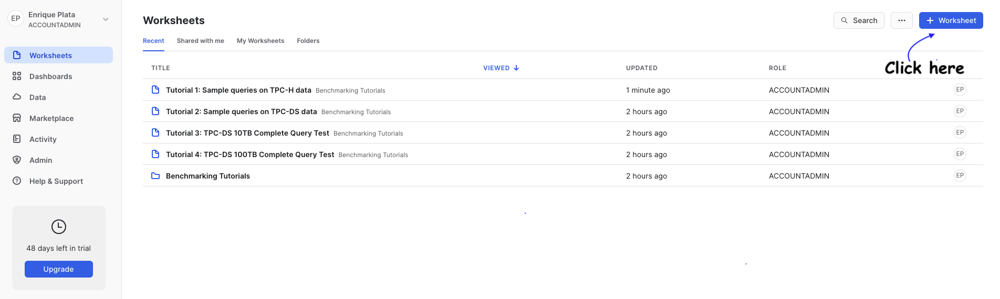
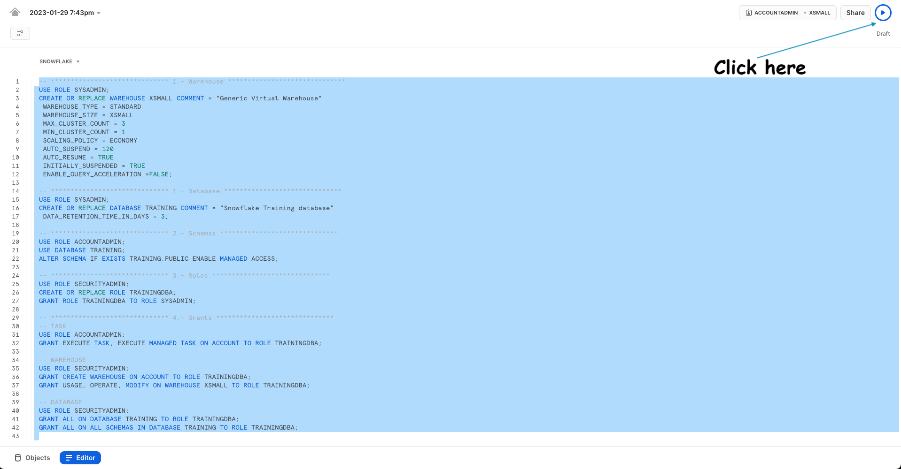
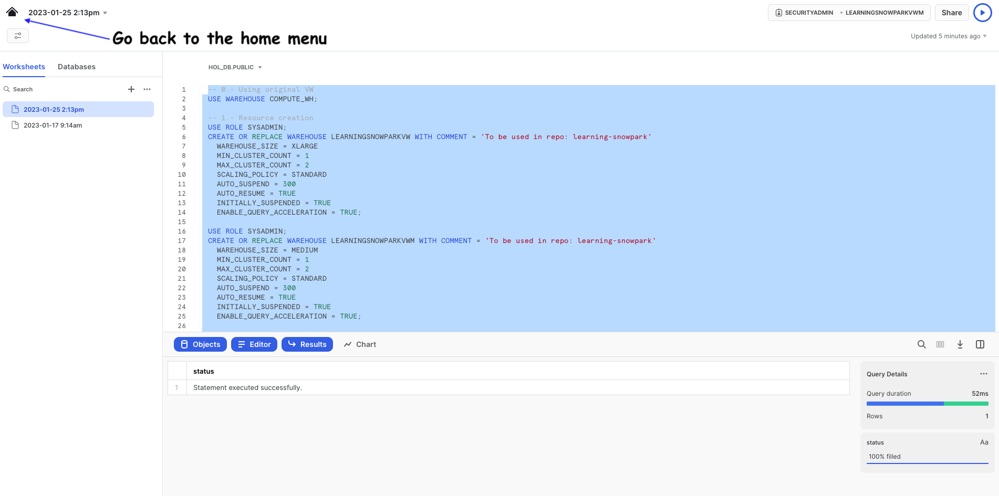

# Learning-Snowflake
This repository will walk you through running Snowflake as your first hands-on.

## Requirements
* Snowflake Account
   * [Signup](https://signup.snowflake.com/) for a FREE Snowflake account, make sure that you select the following setup is placed:
   * 
   * In your mailbox you should have received an email, this will activate the account
   * 
   * Activate your account, and make sure you remember the user & password, you will need them in the next step to log in, it's VERY important you remember them otherwise this will NOT work.

## Setup
  * Once you are logged into your Snowflake account, click in the top right corner and create a new worksheet
    * 
  * Inside of this repository there is a sql scrip, copy the code and paste it in the new worksheet you just created, here is the script link [setup.sql](setup-clean/00_setup.sql)
  * Once you pasted, select all and run the script.
    * 
  * Go back to the home menu
    * 
  * Create a new worksheet and wait instructions

## Author
* **Enrique Plata**
