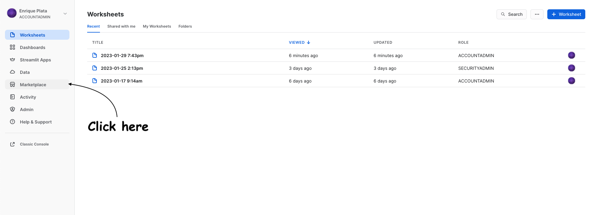
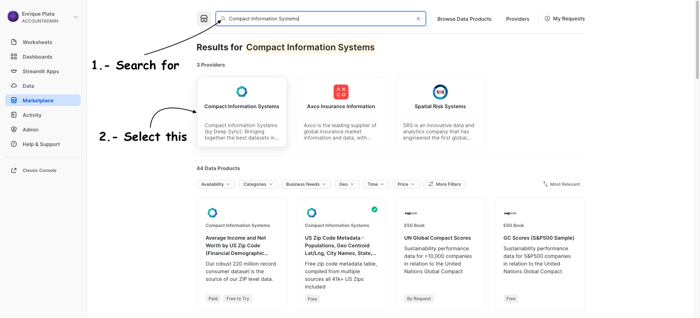
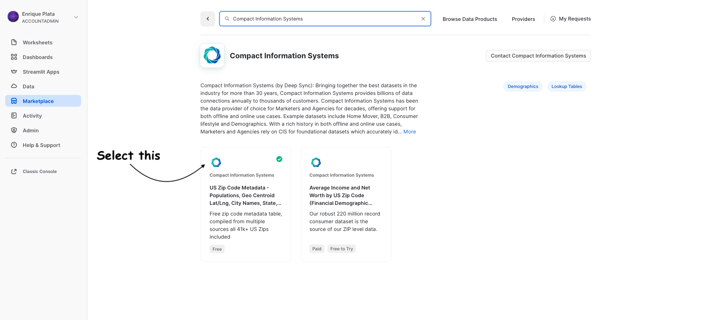
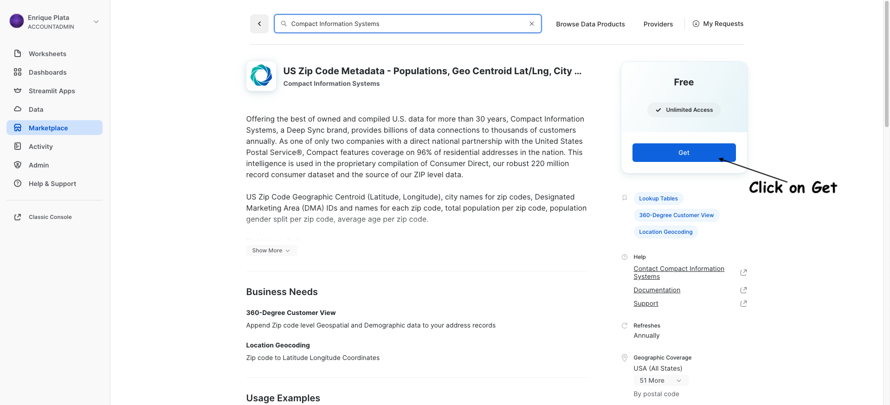
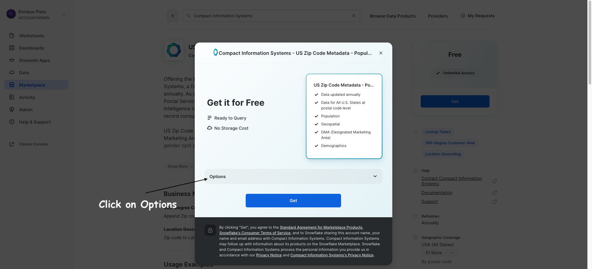
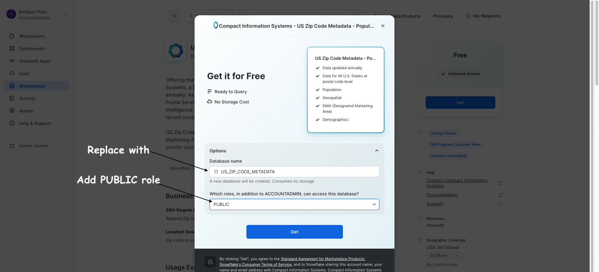
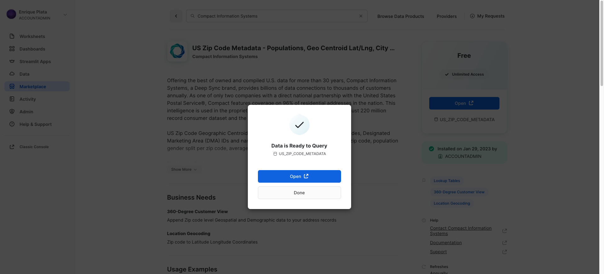

# Marketplace Data
Read this instructions in order to get a dataset from the marketplace.

## US_ZIP_CODE_METADATA
  * Once you are logged into your Snowflake account, click in the marketplace section
    * 
  * Search for the provider: **Compact Information Systems**
    * 
  * Select the FREE version
    * 
  * Click on Get
    * 
  * Select Options
    * 
  * Replace Database name with **US_ZIP_CODE_METADATA** and add **PUBLIC** as an additional role
    * 
  * Click on done
    * 

## Author
* **Enrique Plata**
